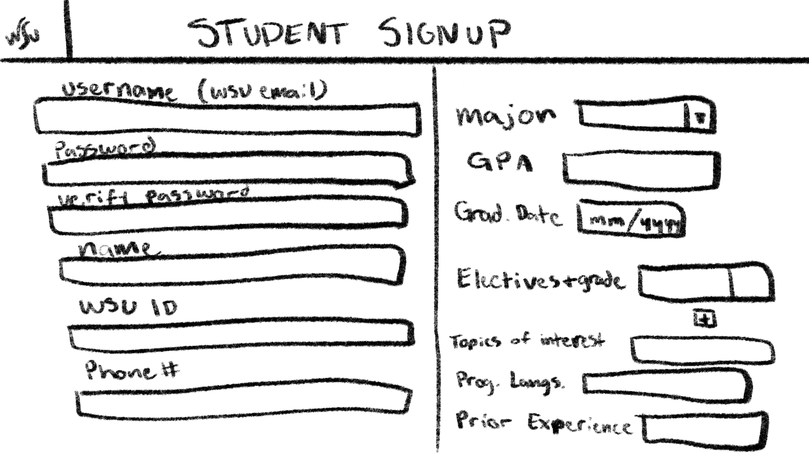
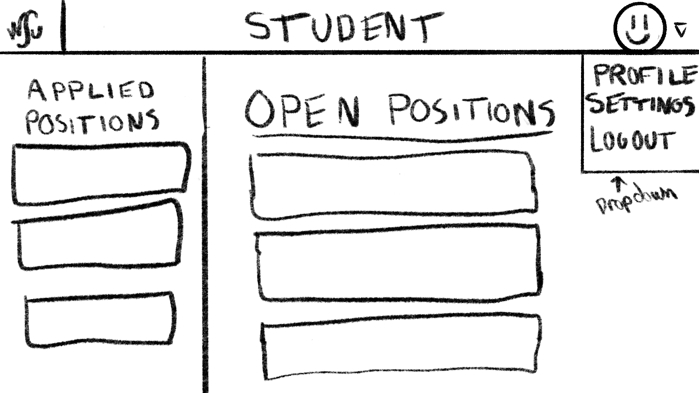
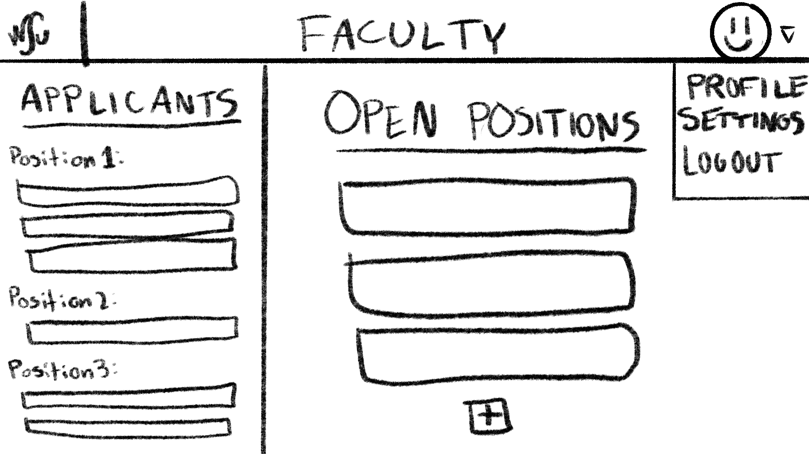
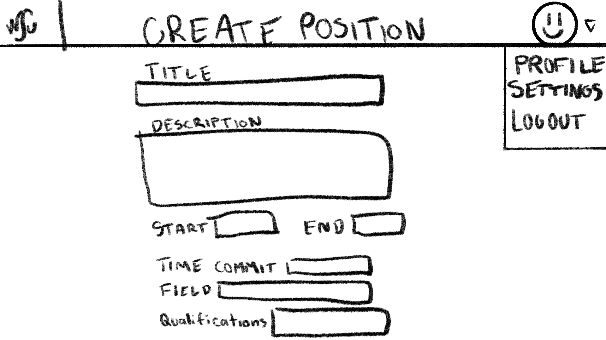

# WSU EECS Undergraduate Research Website - Software Requirements Specification

Prepared by:

* `Benjamin Michaelis`
* `Blake Thomas`
* `Eric Song`
* `Zach Griswold`

--------

**Course** : CptS 322 - Software Engineering Principles I

**Instructor**: Sakire Arslan Ay

--------

## Table of Contents

* [WSU EECS Undergraduate Research Website - Software Requirements Specification](#wsu-eecs-undergraduate-research-website---software-requirements-specification)
  * [Table of Contents](#table-of-contents)
  * [Document Revision History](#document-revision-history)
  * [1. Introduction](#1-introduction)
    * [1.1 Document Purpose](#11-document-purpose)
    * [1.2 Product Scope](#12-product-scope)
    * [1.3 Document Overview](#13-document-overview)
  * [2. Requirements Specification](#2-requirements-specification)
    * [2.1 Customer, Users, and Stakeholders](#21-customer-users-and-stakeholders)
    * [2.2 Use Cases](#22-use-cases)
    * [2.3 Non-Functional Requirements](#23-non-functional-requirements)
  * [3. User Interface](#3-user-interface)
  * [4. References](#4-references)
  * [Appendix: Grading Rubric](#appendix-grading-rubric)

## Document Revision History

| Name      | Date   | Changes   | Version   |
| ------    | ------ | --------- | --------- |
| Revision 1 | 2021-10-05 | Initial draft | 1.0 |
| Revision 2 | 2021-10-13 | Completed Document | 2.0 |
|           |        |           |           |

--------

## 1. Introduction

An overview as to what is expected to be built for the WSU EECS Undergraduate Research Website, and the requirements involved to accomplish that.

--------

### 1.1 Document Purpose

The goal of this document is to have one central place to collect all the requirements of what this website must do so that all the developers can understand what is required of the software including what to design, implement, and test; so the customers can know what will be delivered and so any managers can know in what timeline progress is to be made at.

### 1.2 Product Scope

This website will connect students and faculty together, allowing undergraduate students to find research opportunities and faculty to advertise research opportunities that they might have. This will allow students to also apply for research positions quickly and easily within this site, as well as allow faculty to follow up with students who are interested in their research opportunities.

### 1.3 Document Overview

From here on, different requirements will be covered, from expected use cases by users to the functionality that is expected both for the developer to implement and the customer to understand how the final product will function.

--------

## 2. Requirements Specification

--------

This section specifies the software product's requirements. Specify all of the software requirements to a level of detail sufficient to enable designers to design a software system to satisfy those requirements, and to enable testers to test that the software system satisfies those requirements.

### 2.1 Customer, Users, and Stakeholders

The customer for this site is Washington State University VCEA and the main users would be undergraduate students or faculty members at Washington State University.

--------

### 2.2 Use Cases

Users will be the main people (faculty and students) that we are focusing our cases on.

| Create Account as a user without an account      |  |
| ------------------|---|
| Name              | Create Account |
| Users             | Any non-logged in user |
| Rationale         | To be able to use the site you need to be able to create an account to use the site |
| Triggers          | You go to the registration page/click the button |
| Preconditions     | User has a valid @wsu.edu email that is not already tied to an account. |
| Actions           | User fills out form with required information, system validates email requirements, creates new account record, and user is sent to login page if successful |
| Alternative paths | Error is posted and user needs to use a different email that is actually valid (not used and is @wsu.edu) |
| Postconditions    | Account for user is created. |
| Acceptance tests  | User account is stored by system with correct information to what user supplied. |
| Iteration         | Iteration - 1 |

| Log in as a user  |  |
| ------------------|---|
| Name              | Log into Account |
| Users             | Any user with proper credentials |
| Rationale         | Users should be able to log back in and have their information and applications/positions saved |
| Triggers          | Go to the homepage and click on returning user |
| Preconditions     | User has a valid @wsu.edu email with a valid password |
| Actions           | User fills out form with email and password, and user is sent to login page if successful |
| Alternative paths | Error is posted and user needs to enter valid credentials |
| Postconditions    | User is logged into their account and taken to their homepage |
| Acceptance tests  | User account is now logged in. |
| Iteration         | Iteration - 1 |

| Create Research Position  |  |
| ------------------|---|
| Name              | Create Research position |
| Users             | Any faculty member who is currently logged in |
| Rationale         | Faculty members should be able to create Research positions for students to apply to |
| Triggers          | Go to the homepage and click on create research position |
| Preconditions     | User is a logged in faculty member |
| Actions           | User fills out form with details about the research position, and it is posted when successful |
| Alternative paths | Error is posted and user needs to fill out required fields |
| Postconditions    | Research position is posted to the site |
| Acceptance tests  | Research position appears in database of currently open positions |
| Iteration         | Iteration - 1 |

| Apply to Research Position  |  |
| ------------------|---|
| Name              | Apply to Research Position |
| Users             | Any student who is currently logged in |
| Rationale         | Students should be able to apply to the research positions that faculty have posted |
| Triggers          | Click the apply button on a research posting |
| Preconditions     | User is a logged in as a student |
| Actions           | User fills out form with a statement about the research topic and the name + email of a faculty member as a reference |
| Alternative paths | Error is posted and user needs to fill out required fields |
| Postconditions    | Research position is displayed as applied to student, and as pending to faculty who posted it |
| Acceptance tests  | Student application is created and stored |
| Iteration         | Iteration - 1 |

| Cancel Research Position Application |  |
| ------------------|---|
| Name              | Cancel Research Position Application |
| Users             | Any student who has already applied to a research position and is logged in |
| Rationale         | Students should be able to cancel any applications if they change their mind |
| Triggers          | Click the x button on a research posting |
| Preconditions     | User is a logged in as a student and has already applied to the specific position, which has not been reviewed yet by the faculty member who posted it|
| Actions           | User clicks on cancel application then hits confirm in the subsequent dialog box |
| Alternative paths | Error is posted and user needs to try and cancel again |
| Postconditions    | Research position is no longer displayed as applied to as student, and the application is no longer visible to the faculty member |
| Acceptance tests  | Research position application for this student no longer exists |
| Iteration         | Iteration - 1 |

| View Open Research Positions |  |
| ------------------|---|
| Name              | View Open Research Positions  |
| Users             | Any student who is currently logged in |
| Rationale         | Students should be able view open applications and choose a research topic that interests them |
| Triggers          | User logs in as student, then is taken to home page where research position are displayed |
| Preconditions     | User is a logged in as a student |
| Actions           | User logs in as student, then is taken to home page where research positions are displayed |
| Alternative paths | Error is posted and user needs to try and log in again |
| Postconditions    | Research position are displayed on student homepage |
| Acceptance tests  | Research position UI elements are visible on student homepage |
| Iteration         | Iteration - 1 |

| Expand Research Position |  |
| ------------------|---|
| Name              | Expand Research Position  |
| Users             | Any student or faculty member who is currently logged in |
| Rationale         | Students should be able to click on a research position and get more information about it, like a brief description, start/end date, required time commitment, research fields, required qualifications, and faculty name + contact information |
| Triggers          | User clicks on a research position on the home page |
| Preconditions     | User is a logged in as a student |
| Actions           | User clicks on a position, then is taken to a page where all relevant information about the posting is displayed |
| Alternative paths | Error is posted and user needs to try again |
| Postconditions    | Research position details are displayed |
| Acceptance tests  | Research position detail UI elements are visible on student homepage |
| Iteration         | Iteration - 1 |

| Apply to Research Position  |  |
| ------------------|---|
| Name              | Apply to Research Position |
| Users             | Any student who is currently logged in |
| Rationale | Students should be able to apply to the research positions that faculty have posted |
| Triggers | Click the apply button on a research posting |
| Preconditions | User is a logged in as a student |
| Actions | User fills out form with a statement about the research topic and the name + email of a faculty member as a reference |
| Alternative paths | Error is posted and user needs to fill out required fields |
| Postconditions | Research position is displayed as applied to student, and as pending to faculty who posted it |
| Acceptance tests  | Student application is created and stored |
| Iteration | Iteration - 1 |

| Create application framework code |  |
| ------------------|---|
| Name              | Create framework code for application |
| Users             | N/A |
| Rationale         | Get a base working framework started to build off of |
| Triggers          | N/A |
| Preconditions     | N/A |
| Actions           | Refer to smile application to create framework to start our application with |
| Alternative paths | N/A |
| Postconditions    | N/A |
| Acceptance tests  | Flask application successfully builds and runs and database is built properly |
| Iteration         | Iteration-1 |

| Faculty view list of students who applied for their positions |  |
| ------------------|---|
| Name              | Faculty view list of students who applied for their positions |
| Users             | Faculty |
| Rationale         | Faculty should be able to see the list of students who applied for their position |
| Triggers          | Faculty selects applicants button on their course page |
| Preconditions     | User is logged in as faculty |
| Actions           | System validates that it is a faculty member logged in, then system lists students that applied for a course when button is clicked. |
| Alternative paths | Error if the user is not faculty or does not own the class trying to be accessed |
| Postconditions    | List of students is displayed |
| Acceptance tests  | Accurate list of students is show to faculty member |
| Iteration         | Iteration-1 |

| Faculty can see information about students that applied for position |  |
| ------------------|---|
| Name              | Faculty can see information about students that applied for position |
| Users             | Faculty |
| Rationale         | Faculty should be able to view the qualifications of students. |
| Triggers          | From the list of students who applied, click on a student |
| Preconditions     | User is a faculty member |
| Actions           | When student from list is clicked, information about them is displayed including whether or not they have other offers, their GPS, courses taken, interests, program language experience, and prior research experience |
| Alternative paths | Error if user is not faculty |
| Postconditions    | Information about the student is displayed |
| Acceptance tests  | Accurate information from database is displayed |
| Iteration         | Iteration-2 |

| Faculty can update student application status |  |
| ------------------|---|
| Name              | Faculty can update student application status |
| Users             | Faculty |
| Rationale         | Faculty should be able to approve students for interview, hire them or update as not hired. |
| Triggers          | Select dropdown menu on student |
| Preconditions     | User is a faculty member |
| Actions           | When student from list is clicked, you can choose whether to approve them for interview, hire them, or deny them |
| Alternative paths | Error if user is not faculty |
| Postconditions    | System is updated with new student status |
| Acceptance tests  | Information is accurately updated in database |
| Iteration         | Iteration-2 |

**Include a swim-lane diagram that illustrates the message flow and activities for following scenario:**
“A student applies to a research position; initially its status will appear as “Pending”. The faculty who created that position reviews the application and updates the application status to either “Approved for Interview”, or “Hired”, or “Not hired”. The updated status of the application is displayed on the student view.
The student may delete the pending applications (i.e., whose status is still “Pending”. )”

--------

### 2.3 Non-Functional Requirements

List the non-functional requirements in this section.

1. Security: Since we are login/logout methods, this means there will be private information in our databases, such as emails, passwords, addresses, course work, and other contact information. Since these will be present, we need to make sure that all of our user's private information is stored securely and not possible to access for unauthorized users.

2. Scalability: This web application will have many get and posts requests all firing at the same time. With it being a platform for both faculty and students, we can expect a few hundred of users at least accessing the platform at a time. The webapp needs to be scalable and be able to handle many users at once.

3. Availability: There shouldn't be any time constraints on when user could access this application. Since everyone has a different schedule, some students may be wanting to post some research applications or upload some of their old coursework to update their account. Additionally, a professor may need to check on research progress early in the morning as well to plan for their day. That being said, this should be a 24/7 platform that is available for all users at all times.

4. Performance: Given that this platform is only used for WSU EECS students and faculty, it shouldn't be very taxing on performance when compared to websites or platforms that are open to the whole country or even the whole world. Therefore, the platform should perform quickly since it's a first come first serve sort of service when it comes to features like accepting research applications, or posting research applications. Since these are time sensitive tasks, our application should be able to process requests quickly with little latency and not take longer than a few seconds for the application to load.

5. Capacity: This application should expect a few thousand users at a time. Giving us that buffer will be helpful for cleaning out old unused accounts to students who have graduated or switched majors or some other form of resignation. Adding to that number would also be the faculty in the EECS college. So having a large enough capacity to handle a few thousand users and multiple thousand research projects is crucial for this platform or else we won't have enough capacity to handle all of our users needs.

6. Compatibility: Our application should be compatible for any sort of web browser or operating system, however it will be ok if we have it centralized around one browser or service like google chrome. So long as it still works on other browsers, its ok for it work better on one particular one.

7. Usability: The application isn't all too complex or confusing, meaning it should be very intuitive on how to use it and it must have a clean UI that's not convoluted or clunky. A HUGE indicator of a good web application is it's UI and our's shouldn't fall short in this department. Any student should be able to update their account or post/accept research projects with ease and in only a few webpages, and faculty should be able to monitor and change their research positions only in a couple webpages as well. Nothing about this platform should be confusing since all the functionality in it is straight-forward and easily understood.

--------

## 3. User Interface

Student Sign Up page: 
Student main page: 
Student apply position page: 
Faculty main page: 
Faculty create position page: 

--------

## 4. References

* What is a Swimlane Diagram: <https://www.lucidchart.com/pages/tutorial/swimlane-diagram>
